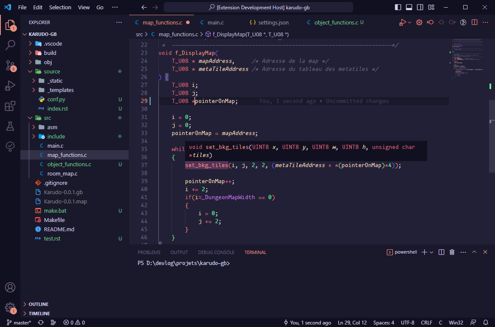

# Oboro

A soft, dark theme for **Visual Studio Code**.

# Installation

**Oboro** can be installed directly through the [Visual Studio Code Marketplace](https://marketplace.visualstudio.com/items/Kusefiru.oboro).

# Notes

**Oboro** has mostly been tested with `C`, `C#` and `Python`.\
If you would like to improve support for another language, feel free to open an [issue](https://github.com/Kusefiru/Oboro/issues/new) or create a PR.

Global color scheme improvements are also welcome.

I recommend the following fonts with **Oboro**:

- [Fira Code](https://github.com/tonsky/FiraCode)
- [mononoki](https://github.com/madmalik/mononoki)

# License

**Oboro** is licensed under [MIT License](./LICENSE)
